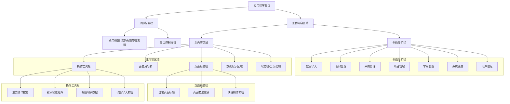
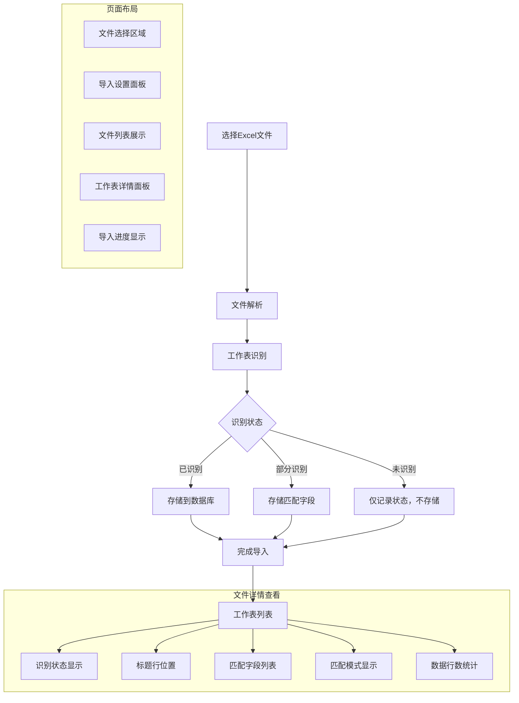
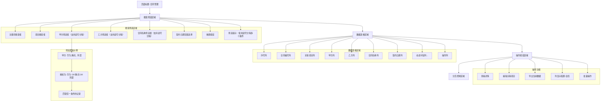
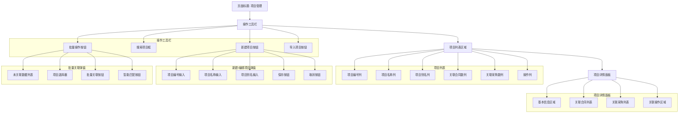
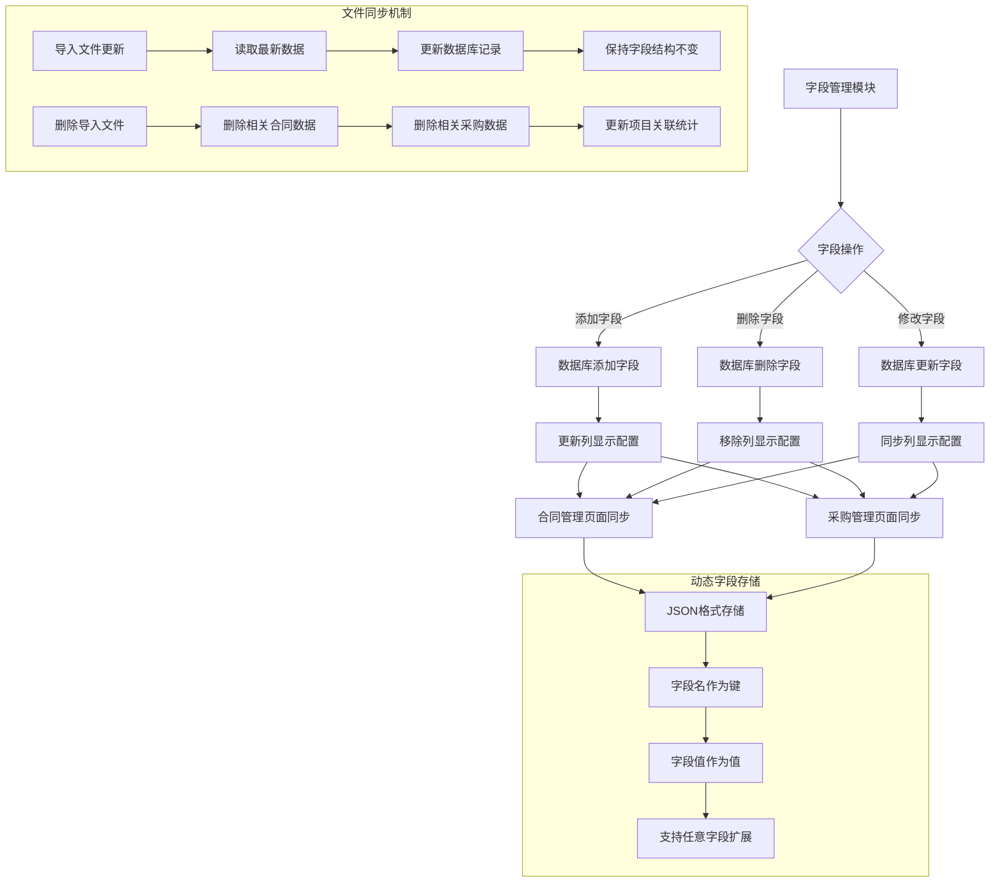
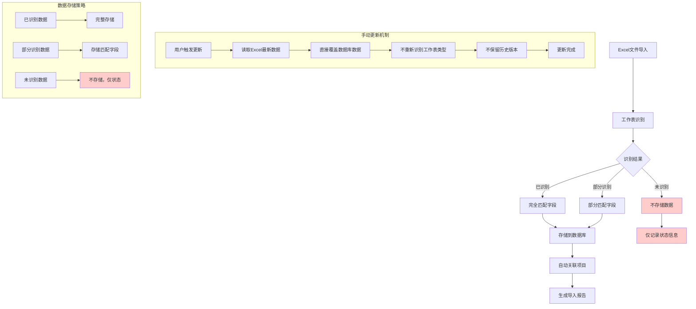

# 采购合同管理系统 - 设计原型图

## 1. 主界面布局设计

```mermaid
graph TD
    A[应用程序窗口] --> B[顶部标题栏]
    A --> C[主体内容区域]
    
    B --> D[应用标题: 采购合同管理系统]
    B --> E[窗口控制按钮]
    
    C --> F[侧边导航栏]
    C --> G[主内容区域]
    
    subgraph "侧边导航栏"
        H[数据导入]
        I[合同管理]
        J[采购管理]
        K[项目管理]
        L[字段管理]
        M[系统设置]
        N[用户信息]
    end
    
    subgraph "主内容区域"
        O[页面标题栏]
        P[面包屑导航]
        Q[操作工具栏]
        R[数据展示区域]
        S[状态栏/分页控制]
    end
    
    subgraph "页面标题栏"
        T[当前页面标题]
        U[页面描述信息]
        V[快捷操作按钮]
    end
    
    subgraph "操作工具栏"
        W[主要操作按钮]
        X[搜索筛选组件]
        Y[视图切换按钮]
        Z[导出/导入按钮]
    end
    
    F --> H
    F --> I
    F --> J
    F --> K
    F --> L
    F --> M
    F --> N
    
    G --> O
    G --> P
    G --> Q
    G --> R
    G --> S
    
    O --> T
    O --> U
    O --> V
    
    Q --> W
    Q --> X
    Q --> Y
    Q --> Z
```

## 2. 数据导入页面设计

```mermaid
flowchart TD
    A[选择Excel文件] --> B[文件解析]
    B --> C[工作表识别]
    C --> D{识别状态}
    D -->|已识别| E[存储到数据库]
    D -->|部分识别| F[存储匹配字段]
    D -->|未识别| G[仅记录状态，不存储]
    
    E --> H[完成导入]
    F --> H
    G --> H
    
    subgraph "文件详情查看"
        I[工作表列表]
        J[识别状态显示]
        K[标题行位置]
        L[匹配字段列表]
        M[匹配模式显示]
        N[数据行数统计]
    end
    
    subgraph "页面布局"
        O[文件选择区域]
        P[导入设置面板]
        Q[文件列表展示]
        R[工作表详情面板]
        S[导入进度显示]
    end
    
    H --> I
    I --> J
    I --> K
    I --> L
    I --> M
    I --> N
```

## 3. 完整的合同管理页面设计（含或关系筛选）

```mermaid
graph TD
    A[页面标题: 合同管理] --> B[搜索筛选区域]
    B --> C[数据表格区域]
    C --> D[操作按钮区域]
    D --> E[分页控制区域]
    
    subgraph "搜索筛选区域"
        F[关键词搜索框]
        G[项目搜索框]
        H["甲方筛选框（支持逗号分隔）"]
        I["乙方筛选框（支持逗号分隔）"]
        J["合同名称筛选框（支持逗号分隔）"]
        K[签约日期范围选择]
        L[重置按钮]
        M[筛选提示：使用逗号分隔多个条件]
    end
    
    subgraph "数据表格区域"
        N[序号列]
        O[合同编号列]
        P[关联项目列]
        Q[甲方列]
        R[乙方列]
        S[合同名称列]
        T[签约日期列]
        U[动态字段列...]
        V[操作列]
    end
    
    subgraph "操作功能"
        W[查看详情]
        X[编辑关联项目]
        Y[导出当前数据]
        Z[列显示配置-全局]
        AA[批量操作]
    end
    
    subgraph "筛选逻辑示例"
        BB["甲方: 华为,腾讯，阿里"]
        CC["解析为: 华为 OR 腾讯 OR 阿里"]
        DD["匹配任一条件的记录"]
    end
    
    B --> F
    B --> G
    B --> H
    B --> I
    B --> J
    B --> K
    B --> L
    B --> M
    
    C --> N
    C --> O
    C --> P
    C --> Q
    C --> R
    C --> S
    C --> T
    C --> U
    C --> V
    
    D --> W
    D --> X
    D --> Y
    D --> Z
    D --> AA
    
    H --> BB
    BB --> CC
    CC --> DD
```

## 4. 项目管理页面设计

```mermaid
graph TD
    A[页面标题: 项目管理] --> B[操作工具栏]
    B --> C[项目列表区域]
    C --> D[项目详情面板]
    
    subgraph "操作工具栏"
        E[新建项目按钮]
        F[搜索项目框]
        G[批量操作按钮]
        H[导入项目按钮]
    end
    
    subgraph "项目列表"
        I[项目编号列]
        J[项目名称列]
        K[项目别名列]
        L[关联合同数列]
        M[关联采购数列]
        N[操作列]
    end
    
    subgraph "项目详情面板"
        O[基本信息区域]
        P[关联合同列表]
        Q[关联采购列表]
        R[关联操作区域]
    end
    
    subgraph "新建/编辑项目弹窗"
        S[项目编号输入]
        T[项目名称输入]
        U[项目别名输入]
        V[保存按钮]
        W[取消按钮]
    end
    
    subgraph "批量关联弹窗"
        X[未关联数据列表]
        Y[项目选择器]
        Z[批量关联按钮]
        AA[智能匹配按钮]
    end
    
    B --> E
    B --> F
    B --> G
    B --> H
    
    C --> I
    C --> J
    C --> K
    C --> L
    C --> M
    C --> N
    
    D --> O
    D --> P
    D --> Q
    D --> R
    
    E --> S
    E --> T
    E --> U
    E --> V
    E --> W
    
    G --> X
    G --> Y
    G --> Z
    G --> AA
```

## 5. 数据库动态字段同步机制

```mermaid
flowchart TD
    A[字段管理模块] --> B{字段操作}
    B -->|添加字段| C[数据库添加字段]
    B -->|删除字段| D[数据库删除字段]
    B -->|修改字段| E[数据库更新字段]
    
    C --> F[更新列显示配置]
    D --> G[移除列显示配置]
    E --> H[同步列显示配置]
    
    F --> I[合同管理页面同步]
    G --> I
    H --> I
    
    F --> J[采购管理页面同步]
    G --> J
    H --> J
    
    subgraph "文件同步机制"
        K[导入文件更新] --> L[读取最新数据]
        L --> M[更新数据库记录]
        M --> N[保持字段结构不变]
        
        O[删除导入文件] --> P[删除相关合同数据]
        P --> Q[删除相关采购数据]
        Q --> R[更新项目关联统计]
    end
    
    subgraph "动态字段存储"
        S[JSON格式存储]
        T[字段名作为键]
        U[字段值作为值]
        V[支持任意字段扩展]
    end
    
    I --> S
    J --> S
    S --> T
    T --> U
    U --> V
```

## 6. 数据处理流程

```mermaid
flowchart TD
    A[Excel文件导入] --> B[工作表识别]
    B --> C{识别结果}
    
    C -->|已识别| D[完全匹配字段]
    C -->|部分识别| E[部分匹配字段]
    C -->|未识别| F[不存储数据]
    
    D --> G[存储到数据库]
    E --> G
    F --> H[仅记录状态信息]
    
    G --> I[自动关联项目]
    I --> J[生成导入报告]
    
    subgraph "手动更新机制"
        K[用户触发更新] --> L[读取Excel最新数据]
        L --> M[直接覆盖数据库数据]
        M --> N[不重新识别工作表类型]
        N --> O[不保留历史版本]
        O --> P[更新完成]
    end
    
    subgraph "数据存储策略"
        Q[已识别数据] --> R[完整存储]
        S[部分识别数据] --> T[存储匹配字段]
        U[未识别数据] --> V[不存储，仅状态]
    end
    
    style F fill:#ffcccc
    style H fill:#ffcccc
    style V fill:#ffcccc
```
